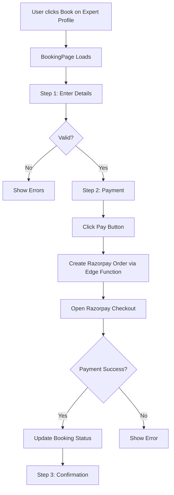

# 📚 Booking System Setup Guide

## Overview
Complete booking system with Razorpay payment integration for Peacix mental health platform.

## 🎯 Features Implemented

### Frontend Components
1. **BookingPage** (`/booking/:expertId`)
   - 3-step booking flow (Details → Payment → Confirmation)
   - Patient information collection
   - Date & time selection
   - Session type selection (Video/Phone/In-Person)
   - Razorpay payment integration

2. **ExpertDetail Page**
   - Updated "Book Appointment" button
   - Navigates to booking page with expert ID

3. **Database Integration**
   - Creates bookings in `bookings` table
   - Links patients and clinicians via foreign keys
   - Stores payment details
   - Auto-creates patient records if needed

## 🔧 Setup Instructions

### 1. Environment Variables

Create `.env` file in frontend root:

```bash
VITE_SUPABASE_URL=your_supabase_url
VITE_SUPABASE_ANON_KEY=your_supabase_anon_key
VITE_RAZORPAY_KEY_ID=your_razorpay_key_id
```

### 2. Install Razorpay SDK in Frontend

```bash
cd frontend
npm install razorpay
```

Add Razorpay script to `index.html`:

```html
<head>
  <!-- Add before closing head tag -->
  <script src="https://checkout.razorpay.com/v1/checkout.js"></script>
</head>
```

### 3. Deploy Supabase Edge Function

Navigate to supabase folder:

```bash
cd supabase
```

Login to Supabase:

```bash
supabase login
```

Link to your project:

```bash
supabase link --project-ref your_project_ref
```

Deploy the function:

```bash
supabase functions deploy create-razorpay-order
```

Set environment variables for the function:

```bash
supabase secrets set RAZORPAY_KEY_ID=your_razorpay_key_id
supabase secrets set RAZORPAY_KEY_SECRET=your_razorpay_secret_key
```

### 4. Database Schema

Your existing schema already supports bookings! The system uses these tables:

- `bookings` - Main booking records
- `clinicians` - Expert information
- `patients` - Patient information
- `profiles` - User profiles
- `appointments` - Confirmed appointments

### 5. Razorpay Account Setup

1. Sign up at [Razorpay](https://razorpay.com)
2. Get your API Keys from Settings → API Keys
3. For testing, use Test Mode keys
4. For production, use Live Mode keys

## 📖 How It Works

### Booking Flow



### Step-by-Step Process

1. **User clicks "Book Appointment"** on ExpertDetail page
2. **Navigates to** `/booking/:expertId`
3. **Step 1 - Details Collection:**
   - Patient name, email, phone
   - Session type (video/phone/in-person)
   - Preferred date & time
   - Additional notes
4. **Step 2 - Payment:**
   - Shows booking summary
   - Calls Supabase Edge Function to create Razorpay order
   - Opens Razorpay checkout modal
   - User completes payment
5. **Step 3 - Confirmation:**
   - Booking saved to database
   - Payment ID stored
   - Confirmation shown to user
   - Email/SMS notifications (to be implemented)

## 💾 Database Fields Used

### `bookings` table:
```sql
- patient_id (uuid) → Links to patients table
- clinician_profile_id (uuid) → Links to clinicians table
- session_type (enum) → 'video', 'phone', 'in-person'
- scheduled_at (timestamp) → Booking date/time
- duration_mins (int) → Session duration
- amount_cents (int) → Amount in smallest currency unit
- currency (char) → 'INR', 'USD', etc.
- status (enum) → 'pending', 'confirmed', 'cancelled'
- payment_provider (text) → 'razorpay'
- payment_id (text) → Razorpay payment ID
- patient_notes (text) → User's additional notes
```

## 🎨 UI Customization

The booking page uses your existing design system:
- Colors: `primary`, `secondary`, `accent` from your HSL palette
- Components: Reuses Button, toast notifications
- Responsive: Mobile-friendly layout
- Animations: Framer Motion for smooth transitions

## 🔒 Security Considerations

1. **Authentication Required**
   - Users must be logged in to complete booking
   - Patient records linked to auth.users

2. **Payment Security**
   - All payments processed via Razorpay
   - No sensitive data stored in your database
   - PCI DSS compliant

3. **RLS Policies**
   
   Add these to your Supabase database:

```sql
-- Patients can view their own bookings
CREATE POLICY "Users can view own bookings"
ON bookings FOR SELECT
USING (auth.uid() = patient_id);

-- Patients can create bookings
CREATE POLICY "Users can create bookings"
ON bookings FOR INSERT
WITH CHECK (auth.uid() = patient_id);

-- Clinicians can view their bookings
CREATE POLICY "Clinicians can view their bookings"
ON bookings FOR SELECT
USING (
  EXISTS (
    SELECT 1 FROM clinicians
    WHERE clinicians.profile_id = clinician_profile_id
    AND clinicians.profile_id = auth.uid()
  )
);
```

## 🧪 Testing

### Test Payment Flow

1. Use Razorpay Test Mode keys
2. Use test cards provided by Razorpay:
   - Success: `4111 1111 1111 1111`
   - Failure: `4000 0000 0000 0002`
3. Any CVV (e.g., 123)
4. Any future expiry date

### Manual Testing Checklist

- [ ] Load expert profile
- [ ] Click "Book Appointment"
- [ ] Fill in patient details
- [ ] Select date and time
- [ ] Proceed to payment
- [ ] Complete Razorpay payment
- [ ] Verify confirmation page
- [ ] Check database for booking record

## 📱 Navigation Integration

Updated routes:
```
/experts → Experts listing
/expert/:id → Expert detail page
/booking/:expertId → Booking flow
```

All "View Profile" buttons navigate to `/expert/:id`
All "Book Appointment" buttons navigate to `/booking/:expertId`

## 🚀 Next Steps

### Optional Enhancements

1. **Email Notifications**
   - Send booking confirmation emails
   - Reminder emails before session
   - Use Supabase Edge Functions + SendGrid/AWS SES

2. **SMS Notifications**
   - Twilio integration
   - Booking confirmations
   - Appointment reminders

3. **Calendar Integration**
   - Google Calendar sync
   - Clinician availability management
   - Auto-scheduling

4. **Admin Dashboard**
   - View all bookings
   - Manage appointments
   - Analytics & reports

5. **Patient Portal**
   - View upcoming sessions
   - Reschedule/cancel bookings
   - Session history

## 🐛 Troubleshooting

### Common Issues

**Issue: "Failed to load expert"**
- Check expert ID in URL
- Verify Supabase connection
- Check RLS policies

**Issue: "Payment failed"**
- Verify Razorpay keys in environment
- Check Edge Function deployment
- Review Supabase logs

**Issue: "Booking not created"**
- Check database permissions
- Verify foreign key constraints
- Review patient/clinician IDs

## 📞 Support

For issues or questions:
1. Check Supabase logs: `supabase functions logs`
2. Review browser console
3. Test with Razorpay test mode first

---

**Ready to use!** 🎉

Your booking system is now integrated with:
- ✅ Supabase database
- ✅ Razorpay payments
- ✅ Your existing design system
- ✅ Proper routing and navigation
- ✅ Database schema compliance
