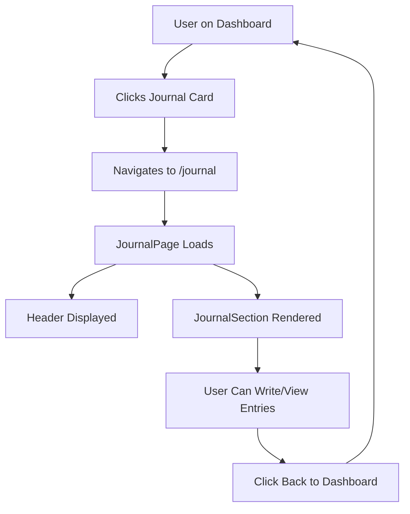

# 📔 Journal Page Navigation Implementation

## Changes Made

### 1. **Created Dedicated Journal Page** 
**File:** `/pages/JournalPage.jsx`

**Features:**
- Full-page journal experience
- Header and Footer included
- Back button to dashboard
- Beautiful page header with description
- Integrates JournalSection component

```jsx
// When user clicks "Journal" in dashboard, they navigate here
navigate("/journal")
```

---

### 2. **Updated Dashboard Quick Actions**
**File:** `/pages/Dashboard.jsx`

**Change:**
```jsx
// Before
<QuickCard icon={<BookOpen size={24} />} title="Journal" />

// After
<QuickCard 
  icon={<BookOpen size={24} />} 
  title="Journal" 
  onClick={() => navigate("/journal")}
/>
```

Now clicking the Journal card navigates to the dedicated journal page.

---

### 3. **Made JournalSection Self-Sufficient**
**File:** `/components/journal/JournalSection.jsx`

**Enhancement:**
```jsx
// Now accepts optional userId prop OR fetches from auth
const JournalSection = ({ userId: propUserId }) => {
  const [userId, setUserId] = useState(propUserId);
  
  useEffect(() => {
    const getUser = async () => {
      if (!propUserId) {
        const { data: { user } } = await supabase.auth.getUser();
        if (user) {
          setUserId(user.id);
        }
      } else {
        setUserId(propUserId);
      }
    };
    getUser();
  }, [propUserId]);
  
  // ... rest of component
};
```

**Benefits:**
- Can be used with or without userId prop
- Automatically fetches authenticated user
- More flexible component usage

---

### 4. **Added Journal Route**
**File:** `/routes/AppRoutes.jsx`

**Route Configuration:**
```jsx
<Route
  path="/journal"
  element={
    <ProtectedRoute allowedRoles={['patient']}>
      <JournalPage />
    </ProtectedRoute>
  }
/>
```

**Security:**
- Protected route (requires authentication)
- Only accessible by 'patient' role
- Redirects to /auth if not logged in

---

## User Flow



---

## File Structure

```
src/
├── pages/
│   ├── Dashboard.jsx          ← Removed journal section
│   └── JournalPage.jsx         ← NEW: Dedicated journal page
├── components/
│   └── journal/
│       └── JournalSection.jsx  ← Updated: Auto-fetches user
└── routes/
    └── AppRoutes.jsx           ← Added /journal route
```

---

## Features Available on Journal Page

### ✅ Full Journal Functionality:
1. **Summary Card** - Stats at top
2. **Write Button** - Opens modal
3. **Search & Filter** - Find entries
4. **Entry List** - View all entries
5. **Expand Entries** - Read full content
6. **Delete Entries** - Remove unwanted entries
7. **Mood Tracking** - Select emotions
8. **Gratitude Practice** - Daily gratitude
9. **Cognitive Reframing** - Thought exercises
10. **Tagging System** - Organize entries

---

## Navigation Paths

### From Dashboard
```
Dashboard → Click "Journal" card → /journal page
```

### From Journal Page
```
Journal Page → Click "Back to Dashboard" → /dashboard
```

### Direct Access
```
Type URL: http://localhost:3000/journal
(Must be logged in as patient)
```

---

## Testing Checklist

- [ ] Go to Dashboard
- [ ] Click "Journal" quick action card
- [ ] Verify navigation to /journal
- [ ] Verify Header is visible
- [ ] Verify Footer is visible
- [ ] Verify back button works
- [ ] Click "Write" button
- [ ] Create a journal entry
- [ ] Verify entry appears in list
- [ ] Click back to dashboard
- [ ] Verify still on dashboard
- [ ] Try accessing /journal while logged out
- [ ] Verify redirect to /auth

---

## Benefits of This Approach

### ✅ Better UX:
- Dedicated space for journaling
- Full-screen experience
- No clutter on dashboard
- Clear separation of concerns

### ✅ Better Performance:
- Dashboard loads faster (no journal data on initial load)
- Journal data only fetched when needed
- Smaller component trees

### ✅ Better Code Organization:
- Single Responsibility Principle
- Dashboard = Dashboard overview
- Journal Page = Full journal features

### ✅ Scalability:
- Easy to add more journal features
- Can add journal-specific routing
- Can create sub-pages (e.g., /journal/analytics)

---

## Optional Future Enhancements

### 1. **Journal Analytics Page**
```
/journal/analytics - Mood charts, writing patterns
```

### 2. **Journal Settings**
```
/journal/settings - Privacy, export options
```

### 3. **Shared Journals** (if feature added)
```
/journal/shared - Collaborative journaling
```

### 4. **Journal Prompts Library**
```
/journal/prompts - Writing prompts browser
```

---

## Summary

✅ **What Changed:**
- Created JournalPage component
- Updated Dashboard Journal card to navigate
- Made JournalSection auto-fetch user
- Added protected /journal route

✅ **What Works:**
- Click Journal → Goes to journal page
- Full journal functionality available
- Back button returns to dashboard
- Authentication required

✅ **Code Quality:**
- Clean separation of concerns
- Reusable components
- Proper routing
- Security with ProtectedRoute

**The journal feature now has its own dedicated page!** 🎉
